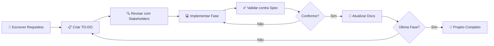

# 🧩 Geek Joke API - Fullstack Application

> **Aplicação Fullstack** desenvolvida com **Vue.js** e **AdonisJS** que consome a [API Geek Joke](https://geek-jokes.sameerkumar.website/api) para entreter desenvolvedores com piadas geek através de uma interface interativa baseada em estados de humor.

---

## 📖 Índice

- [Visão Geral](#-visão-geral)
- [Metodologia de Desenvolvimento](#-metodologia-de-desenvolvimento)
- [Stack Tecnológica](#-stack-tecnológica)
- [Arquitetura](#-arquitetura)
- [Funcionalidades](#-funcionalidades)
- [Pré-requisitos](#-pré-requisitos)
- [Instalação e Execução](#-instalação-e-execução)
- [Estrutura do Projeto](#-estrutura-do-projeto)
- [Credenciais de Acesso](#-credenciais-de-acesso)
- [Endpoints da API](#-endpoints-da-api)
- [Roadmap](#-roadmap)
- [Contribuindo](#-contribuindo)
- [Licença](#-licença)

---

## 🎯 Visão Geral

Este projeto é uma **Single Page Application (SPA)** que demonstra a integração entre um frontend moderno (Vue.js) e um backend robusto (AdonisJS), implementando:

- ✅ **Autenticação JWT** com persistência de sessão
- ✅ **Integração com API externa** (Geek Joke API)
- ✅ **Roteamento dinâmico** baseado em estados de humor
- ✅ **Gerenciamento de estado** com Pinia
- ✅ **Containerização completa** com Docker e Docker Compose
- ✅ **Proxy reverso** com Nginx e SSL/TLS
- ✅ **Testes unitários e de integração**

### 🎭 Fluxo de Interação

```
Login → 😐 Inicial → 😢 Triste → 🫣 Poker Face (piada) → 😄 Feliz → 😐 Inicial
```

Cada clique na tela muda o estado de humor, criando uma experiência interativa e divertida para o usuário.

---

## 📚 Metodologia de Desenvolvimento

### Documentation-Driven Development (DDD)

Este projeto foi desenvolvido seguindo a metodologia **Documentation-Driven Development**, uma abordagem moderna que coloca a **documentação no centro do processo de desenvolvimento**.

#### 🤔 O que é Documentation-Driven Development?

**Documentation-Driven Development** é uma metodologia de desenvolvimento de software onde:

1. **A documentação é escrita PRIMEIRO**, antes de qualquer linha de código
2. **Os requisitos são detalhados** em documentos técnicos estruturados
3. **O código é implementado** seguindo fielmente a documentação
4. **A documentação é mantida atualizada** durante todo o ciclo de vida

É similar ao **Test-Driven Development (TDD)**, mas focado em especificações e arquitetura ao invés de testes.

#### ✨ Princípios Fundamentais

```
📝 DOCUMENTAR → 🔍 REVISAR → 💻 IMPLEMENTAR → ✅ VALIDAR → 🔄 ITERAR
```

1. **Doc First**: Escrever especificações detalhadas antes de codificar
2. **Single Source of Truth**: Documentação é a fonte oficial de requisitos
3. **Incremental**: Documentar e implementar em pequenos incrementos
4. **Living Documentation**: Documentação evolui com o projeto
5. **AI-Friendly**: Ideal para desenvolvimento assistido por LLMs

#### 🚀 Vantagens do DDD

| Vantagem | Descrição |
|----------|-----------|
| 🎯 **Clareza de Requisitos** | Todos os requisitos são definidos antes de codificar, reduzindo ambiguidade |
| 🤝 **Melhor Comunicação** | Documentação clara facilita alinhamento entre stakeholders |
| ⚡ **Menos Retrabalho** | Especificações detalhadas evitam implementações incorretas |
| 📖 **Documentação Sempre Atualizada** | A documentação é parte do processo, não uma tarefa posterior |
| 🎓 **Onboarding Facilitado** | Novos desenvolvedores entendem o projeto rapidamente |
| 🤖 **Otimizado para IA/LLM** | LLMs como Claude podem implementar código seguindo specs detalhadas |
| 🧪 **Testabilidade** | Requisitos claros facilitam criação de testes |
| 🏗️ **Arquitetura Consistente** | Decisões arquiteturais são documentadas e seguidas |
| 📊 **Rastreabilidade** | Fácil rastrear de código para requisito e vice-versa |
| 💰 **Redução de Custos** | Menor custo de manutenção a longo prazo |

#### 🛠️ Como Aplicamos DDD Neste Projeto

1. **REQUISITOS.md**: Especificação completa dos requisitos funcionais e não-funcionais
2. **TO_DO.md**: Plano de implementação dividido em fases com tarefas atômicas
3. **README.md**: Documentação de alto nível e guia de uso
4. **Comentários de Código**: Decisões técnicas documentadas no próprio código
5. **API Documentation**: Endpoints documentados com exemplos
6. **Schema Documentation**: Estrutura de banco documentada

#### 📐 Workflow DDD Aplicado



#### 🎓 Comparação com Outras Metodologias

| Metodologia | Foco Principal | Quando Usar |
|-------------|----------------|-------------|
| **TDD** | Testes primeiro | Lógica complexa, algoritmos críticos |
| **BDD** | Comportamento do usuário | Features orientadas a negócio |
| **DDD (Domain)** | Modelagem de domínio | Sistemas complexos com regras de negócio |
| **Documentation-DDD** | Especificações detalhadas | Projetos com múltiplos stakeholders, desenvolvimento assistido por IA |

#### 💡 Quando Usar Documentation-Driven Development?

✅ **Ideal para:**
- Projetos com equipes distribuídas
- Desenvolvimento assistido por IA/LLM
- Projetos open-source
- Sistemas com requisitos complexos
- Projetos que requerem auditoria/compliance
- Onboarding frequente de novos desenvolvedores

⚠️ **Menos adequado para:**
- MVPs ultra-rápidos (onde velocidade > qualidade)
- Projetos descartáveis/experimentos
- Projetos com requisitos extremamente voláteis

---

## 🧠 Stack Tecnológica

### Backend

| Tecnologia | Versão | Função |
|-----------|---------|---------|
| **Node.js** | 22.x | Runtime JavaScript |
| **AdonisJS** | 6.x | Framework MVC full-featured |
| **Lucid ORM** | 20.x | Object-Relational Mapping |
| **PostgreSQL** | 18.x | Banco de dados relacional |
| **JWT** | - | Autenticação stateless |
| **Axios** | 1.x | Cliente HTTP para consumir API externa |

### Frontend

| Tecnologia | Versão | Função |
|-----------|---------|---------|
| **Vue.js** | 3.x | Framework JavaScript reativo |
| **Vite** | 5.x | Build tool e dev server |
| **Pinia** | 2.x | State management |
| **Vue Router** | 4.x | Roteamento SPA |
| **Vuetify** | 3.x | UI Component Library |
| **Axios** | 1.x | Cliente HTTP |

### DevOps & Infraestrutura

| Tecnologia | Versão | Função |
|-----------|---------|---------|
| **Docker** | 24.x | Containerização |
| **Docker Compose** | 2.x | Orquestração de containers |
| **Nginx** | latest | Reverse proxy e SSL termination |
| **mkcert** | - | Certificados SSL locais |

### Qualidade de Código

| Tecnologia | Versão | Função |
|-----------|---------|---------|
| **ESLint** | 8.x | Linting JavaScript/TypeScript |
| **Prettier** | 3.x | Formatação de código |
| **Jest** | 29.x | Framework de testes |
| **TypeScript** | 5.x | Tipagem estática (opcional) |

---

## 🏗️ Arquitetura

### Diagrama de Arquitetura

```
┌─────────────────────────────────────────────────────────┐
│                       USUÁRIO                            │
│                    (Navegador)                           │
└────────────────────┬────────────────────────────────────┘
                     │ HTTPS
                     ▼
┌─────────────────────────────────────────────────────────┐
│                  NGINX PROXY                             │
│              (SSL Termination)                           │
│    • Porta 80 → 443 (redirect)                          │
│    • Porta 443 (SSL/TLS)                                │
└──────────┬──────────────────────┬───────────────────────┘
           │                      │
           │ /                    │ /api/*
           ▼                      ▼
┌──────────────────┐    ┌──────────────────────────────┐
│   FRONTEND       │    │       BACKEND                │
│   (Vue.js)       │    │       (AdonisJS)             │
│   Porta: 5173    │    │       Porta: 3333            │
│                  │    │                              │
│   • Pinia Store  │    │   • Controllers              │
│   • Vue Router   │    │   • Models (Lucid)           │
│   • Vuetify UI   │◄───┤   • Middleware (Auth)        │
│   • Axios        │────┤   • Services                 │
└──────────────────┘    └───────┬──────────────────────┘
                                │
                                ▼
                    ┌───────────────────────┐
                    │   POSTGRESQL          │
                    │   Porta: 5432         │
                    │   • Tabela users      │
                    │   • Tabela tokens     │
                    └───────────────────────┘
                                │
                                ▼
                    ┌───────────────────────┐
                    │   API EXTERNA         │
                    │   Geek Jokes API      │
                    │   (geek-jokes.*)      │
                    └───────────────────────┘
```

### Fluxo de Autenticação

```
1. User → POST /api/auth/login → Backend
2. Backend valida credenciais no PostgreSQL
3. Backend gera JWT token
4. Frontend armazena token no localStorage
5. Requisições subsequentes incluem: Authorization: Bearer <token>
6. Middleware valida token antes de processar requisição
```

### Fluxo de Piadas

```
1. User clica na tela (estado poker-face)
2. Frontend → GET /api/jokes/random (com JWT)
3. Backend valida token
4. Backend → GET https://geek-jokes.sameerkumar.website/api
5. API externa retorna piada
6. Backend retorna piada ao Frontend
7. Frontend exibe piada em modal
```

---

## ✨ Funcionalidades

### Implementadas

- ✅ **Autenticação JWT**
  - Login com email e senha
  - Validação de formulário
  - Persistência de sessão (localStorage)
  - Proteção de rotas via middleware

- ✅ **Estados de Humor Interativos**
  - `/inicial` - Estado neutro 😐
  - `/triste` - Estado triste 😢
  - `/poker-face` - Estado curioso 🫣 (exibe piada)
  - `/feliz` - Estado feliz 😄

- ✅ **Sistema de Piadas**
  - Consumo da API Geek Joke
  - Exibição em modal interativa
  - Cache de requisições (opcional)

- ✅ **Infraestrutura**
  - Docker e Docker Compose configurados
  - Nginx com SSL/TLS
  - PostgreSQL com persistência de dados
  - Health checks nos containers

### Roadmap Futuro

- [ ] Histórico de piadas visualizadas
- [ ] Sistema de favoritos
- [ ] Compartilhamento de piadas em redes sociais
- [ ] Modo escuro/claro
- [ ] Internacionalização (i18n)
- [ ] PWA (Progressive Web App)
- [ ] Testes E2E com Cypress/Playwright

---

## 📋 Pré-requisitos

### Obrigatórios

- **Docker** >= 24.0
- **Docker Compose** >= 2.0
- **Git** >= 2.30

### Opcionais (para desenvolvimento local sem Docker)

- **Node.js** >= 22.x
- **PostgreSQL** >= 14.x
- **pnpm** ou **npm**

---

## 🚀 Instalação e Execução

### Opção 1: Docker (Recomendado)

#### 1. Clone o repositório
```bash
git clone <repository-url>
cd geek_joke
```

#### 2. Configure as variáveis de ambiente
```bash
# Arquivo .env já está configurado na raiz do projeto
# Verifique se as credenciais estão corretas
cat .env
```

#### 3. Gere certificados SSL locais (primeira vez)
```bash
# Instalar mkcert (se não tiver)
# macOS
brew install mkcert
# Linux
sudo apt install mkcert  # ou equivalente

# Gerar certificados
mkdir -p certs
cd certs
mkcert localhost 127.0.0.1 ::1
cd ..
```

#### 4. Suba os containers
```bash
docker-compose up --build
```

#### 5. Execute as migrations (primeira vez)
```bash
# Em outro terminal
docker exec -it geekjoke-backend sh
cd /app
node ace migration:run
node ace db:seed
exit
```

#### 6. Acesse a aplicação
```
Frontend: https://localhost
Backend API: https://localhost/api
PostgreSQL: localhost:5432
```

### Opção 2: Desenvolvimento Local (Sem Docker)

#### 1. Configurar Backend
```bash
cd backend

# Instalar dependências
npm install

# Configurar .env
cp .env.example .env
# Editar .env com credenciais do PostgreSQL local

# Rodar migrations
node ace migration:run
node ace db:seed

# Iniciar servidor
node ace serve --watch
```

#### 2. Configurar Frontend
```bash
cd frontend

# Instalar dependências
npm install

# Configurar variável de ambiente (criar .env.local)
echo "VITE_API_URL=http://localhost:3333" > .env.local

# Iniciar dev server
npm run dev
```

#### 3. Acessar
```
Frontend: http://localhost:5173
Backend: http://localhost:3333
```

---

## 📁 Estrutura do Projeto

```
geek_joke/
├── backend/                    # API REST AdonisJS
│   ├── app/
│   │   ├── controllers/       # Controladores HTTP
│   │   ├── models/            # Models Lucid ORM
│   │   ├── middleware/        # Middlewares customizados
│   │   └── services/          # Serviços de negócio
│   ├── database/
│   │   ├── migrations/        # Migrations do banco
│   │   └── seeders/           # Seeders de dados
│   ├── start/
│   │   ├── routes.ts          # Definição de rotas
│   │   └── kernel.ts          # Configuração de middleware
│   ├── config/                # Arquivos de configuração
│   ├── tests/                 # Testes unitários e integração
│   └── package.json
│
├── frontend/                   # SPA Vue.js
│   ├── src/
│   │   ├── components/        # Componentes reutilizáveis
│   │   │   ├── LoginForm.vue
│   │   │   ├── MoodView.vue
│   │   │   └── JokeModal.vue
│   │   ├── views/             # Views de rota
│   │   │   ├── LoginView.vue
│   │   │   ├── InicialView.vue
│   │   │   ├── TristeView.vue
│   │   │   ├── PokerFaceView.vue
│   │   │   └── FelizView.vue
│   │   ├── stores/            # Pinia stores
│   │   │   ├── auth.ts
│   │   │   └── mood.ts
│   │   ├── router/            # Configuração de rotas
│   │   │   └── index.ts
│   │   ├── services/          # Serviços de API
│   │   │   └── api.ts
│   │   ├── App.vue            # Componente raiz
│   │   └── main.ts            # Entry point
│   ├── public/                # Assets estáticos
│   ├── tests/                 # Testes de componentes
│   └── package.json
│
├── database/                   # Scripts SQL
│   └── schema.sql             # Schema inicial
│
├── nginx/                      # Configurações Nginx
│   └── conf.d/
│       └── default.conf       # Virtual host config
│
├── certs/                      # Certificados SSL (não versionado)
│   ├── localhost+1.pem
│   └── localhost+1-key.pem
│
├── docker-compose.yml          # Orquestração Docker
├── .env                        # Variáveis de ambiente
├── REQUISITOS.md              # Especificação completa
├── TO_DO.md                   # Plano de implementação (DDD)
└── README.md                  # Este arquivo
```

---

## 🔑 Credenciais de Acesso

### Usuário Padrão

```
Email:    cliente@incuca.com.br
Senha:    seumamesapossuirtrespernaschamadasqualidadeprecobaixoevelocidadeelaseriacapenga
```

### Banco de Dados (via .env)

```
Host:     postgres (ou localhost se fora do Docker)
Porta:    5432
Usuário:  geekjoke_user
Senha:    seumamesapossuirtrespernaschamadasqualidadeprecobaixoevelocidadeelaseriacapenga
Database: geekjoke_db
```

---

## 🔌 Endpoints da API

### Autenticação

#### `POST /auth/login`
Autentica um usuário e retorna um token JWT.

**Request:**
```json
{
  "email": "cliente@incuca.com.br",
  "password": "seumamesapossuirtrespernaschamadasqualidadeprecobaixoevelocidadeelaseriacapenga"
}
```

**Response (200):**
```json
{
  "token": "eyJhbGciOiJIUzI1NiIsInR5cCI6IkpXVCJ9...",
  "user": {
    "id": 1,
    "email": "cliente@incuca.com.br",
    "created_at": "2025-11-04T10:00:00.000Z"
  }
}
```

**Response (401):**
```json
{
  "error": "Invalid credentials"
}
```

---

#### `GET /auth/me`
Retorna dados do usuário autenticado (requer token).

**Headers:**
```
Authorization: Bearer <token>
```

**Response (200):**
```json
{
  "id": 1,
  "email": "cliente@incuca.com.br",
  "created_at": "2025-11-04T10:00:00.000Z"
}
```

---

### Piadas

#### `GET /jokes/random`
Retorna uma piada aleatória da API Geek Joke (requer autenticação).

**Headers:**
```
Authorization: Bearer <token>
```

**Response (200):**
```json
{
  "joke": "Why do programmers prefer dark mode? Because light attracts bugs!"
}
```

**Response (401):**
```json
{
  "error": "Unauthorized"
}
```

---

## 📊 Roadmap

Este projeto segue um roadmap dividido em fases, documentado detalhadamente em `TO_DO.md`.

| Fase | Status | Descrição |
|------|--------|-----------|
| 0️⃣ | ✅ | Setup e Validação de Configurações |
| 1️⃣ | ✅ | Backend - Estrutura Base AdonisJS |
| 2️⃣ | ✅ | Backend - Autenticação JWT |
| 3️⃣ | ✅ | Backend - Integração API Geek Joke |
| 4️⃣ | ✅ | Frontend - Estrutura Base Vue.js |
| 5️⃣ | ✅ | Frontend - Login e Autenticação |
| 6️⃣ | ✅ | Frontend - Rotas de Humor |
| 7️⃣ | ⏳ | Integração Frontend ↔ Backend (Pronto para teste) |
| 8️⃣ | ❌ | Testes Unitários e Integração |
| 9️⃣ | ⏳ | Documentação Final |

---

## 🧪 Testes

### Backend
```bash
cd backend
npm test

# Com coverage
npm test -- --coverage
```

### Frontend
```bash
cd frontend
npm test

# Modo watch
npm test -- --watch
```

### E2E (Futuro)
```bash
npm run test:e2e
```

---

## 🤝 Contribuindo

Contribuições são bem-vindas! Este projeto segue **Documentation-Driven Development**, portanto:

1. **Documente primeiro**: Crie/atualize documentação antes de codificar
2. **Siga o TO_DO.md**: Verifique se sua feature está no roadmap
3. **Fork e PR**: Faça um fork, crie uma branch, e abra um Pull Request
4. **Testes obrigatórios**: Toda nova feature deve ter testes
5. **Code Review**: Aguarde revisão antes do merge

### Processo de Contribuição

```bash
# 1. Fork o projeto
# 2. Clone seu fork
git clone <seu-fork-url>

# 3. Crie uma branch
git checkout -b feature/minha-feature

# 4. Documente a feature em TO_DO.md
# 5. Implemente seguindo a documentação
# 6. Adicione testes
# 7. Commit seguindo conventional commits
git commit -m "feat: adiciona feature X conforme TO_DO.md fase Y"

# 8. Push e abra PR
git push origin feature/minha-feature
```

### Conventional Commits

```
feat: nova funcionalidade
fix: correção de bug
docs: atualização de documentação
style: formatação de código
refactor: refatoração
test: adição de testes
chore: tarefas de build/config
```

---

## 📄 Licença

Este projeto é licenciado sob a licença MIT. Veja o arquivo `LICENSE` para mais detalhes.

---

## 👥 Autores

- **Desenvolvedor Principal**: Jesse
- **Assistente de Desenvolvimento**: Claude Sonnet 4.5 (Anthropic)
- **Metodologia**: Documentation-Driven Development

---

## 🙏 Agradecimentos

- [Geek Joke API](https://github.com/sameerkumar18/geek-joke-api) - API de piadas geek
- [AdonisJS](https://adonisjs.com) - Framework backend robusto
- [Vue.js](https://vuejs.org) - Framework frontend reativo
- [Vuetify](https://vuetifyjs.com) - Componentes Material Design
- Comunidade open-source

---

## 📞 Suporte

- **Documentação Técnica**: Veja `REQUISITOS.md` e `TO_DO.md`
- **Issues**: Use o sistema de issues do GitHub
- **Discussões**: Use GitHub Discussions para dúvidas

---

## 📈 Status do Projeto


---

**Desenvolvido com ❤️ usando Documentation-Driven Development**
